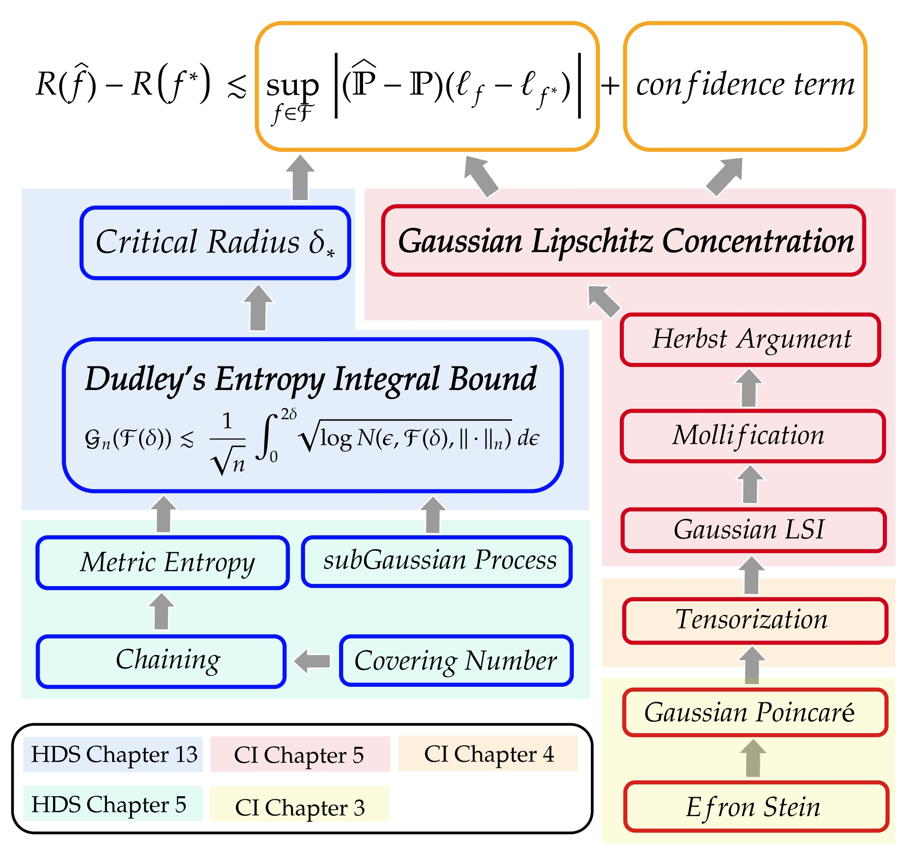
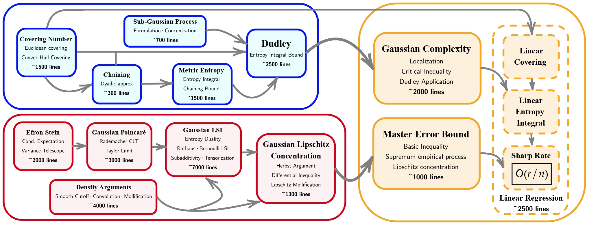

<h1 align="center">Statistical Learning Theory in Lean 4</h1>

<h4 align="center">The first comprehensive Lean 4 formalization of statistical learning theory,<br>a machine-checked, reusable foundation for formalizing ML theory.</h4>

<p align="center">
  <!-- TODO: point the ICML badge to your OpenReview / PMLR page once available -->
  <a href="https://icml.cc/virtual/2026/poster/62752"></a>
  <a href="https://arxiv.org/abs/2602.02285"></a>
  <a href="https://huggingface.co/collections/liminho123/statistical-learning-theory-in-lean-4"></a>
  <a href="https://github.com/YuanheZ/lean-stat-learning-theory/releases/tag/v4.31.0"></a>
  <a href="./LICENSE"></a>
</p>

**SLT** formalizes statistical learning theory in Lean 4 from the ground up, built on empirical process theory: Gaussian Lipschitz concentration, Dudley's entropy integral, and localized least-squares regression with sharp minimax rates. The core development is **accepted at ICML 2026**. Since then, the library has grown well beyond the paper into a broader **high-dimensional probability library**, adding Hanson–Wright inequalities, matrix perturbation theory (Courant–Fischer, Eckart–Young–Mirsky, Weyl, Davis–Kahan), Lieb concavity, and the matrix Bernstein inequality.

## Table of Contents

- [Why SLT?](#why-slt)
- [News](#news)
- [Library Overview](#library-overview)
- [Major Results](#major-results)
- [Getting Started](#getting-started)
- [ICML 2026](#icml-2026)
- [Dataset for LLM Formal Reasoning](#dataset-for-llm-formal-reasoning)
- [Recipe for Vibe Formalization](#recipe-for-vibe-formalization)
- [Citation](#citation)
- [License](#license)
- [Acknowledgements](#acknowledgements)
- [References](#references)

## Why SLT?

**Theorems you won't find in Mathlib.** SLT provides machine-checked proofs of workhorse results of modern statistics and learning theory that are not in Mathlib.

**Fully verified, no gaps.** The library contains no `sorry`, `axiom`, `admit`, or `native_decide`. Every result compiles against latest Mathlib.

**Human-supervised, expert-audited.** Development is semi-autonomous: human-in-the-loop, and statement is evaluated by domain experts for fidelity to the intended mathematics. 

**Actively maintained.** We keep formalizing new results in statistics and learning theory, and each release tracks the latest Mathlib/Lean version so the library stays compatible with the ecosystem — always under the same sorry-free guarantee.

**Built to be built on.** Apache-2.0 licensed, pinned to a released Lean/Mathlib toolchain, and usable as a `lake` dependency in one line (see [Getting Started](#getting-started)).

**Textbook-faithful and citable.** Each major theorem is cross-referenced to its precise source down to theorem numbers (see [Major Results](#major-results)). If you are teaching or studying from these books, you can jump straight to the corresponding formal statement. Formalization also surfaced implicit assumptions and missing steps in the standard textbook proofs, which the Lean code makes explicit.

**More than code.** We also release a practical [recipe for human–AI collaborative formalization](#recipe-for-vibe-formalization) distilled from our supervised development with Claude Code and Codex.

## News

- **2026-07** — Release [`v4.31.0`](https://github.com/YuanheZ/lean-stat-learning-theory/releases/tag/v4.31.0): upgraded to Lean/Mathlib `v4.31.0` and a major expansion beyond the paper — Hanson–Wright, matrix spectral & perturbation theory (SVD, Courant–Fischer, EYM, Weyl, Davis–Kahan), truncated Dudley, Lieb's inequality, and matrix Bernstein.
- **2026-05** — Our paper is **accepted at ICML 2026**. 🎉
- **2026-02** — Initial public release of the ICML 2026 artifact and the [arXiv preprint](https://arxiv.org/abs/2602.02285); Lean 4 training datasets released on [HuggingFace](https://huggingface.co/collections/liminho123/statistical-learning-theory-in-lean-4).

## Library Overview

| Layer | Modules | What's inside |
|-------|---------|---------------|
| Foundations | `SmallBallProb`, `MeasureInfrastructure`, `SubGaussian` | Basic probability tools; scalar sub-Gaussian variables and processes, `psi2` scale, finite maxima, Bernstein-style CGF tails. |
| Matrix infrastructure | `MatrixInfra/` | Singular values and SVD, Courant–Fischer, Eckart–Young–Mirsky, Weyl perturbation, Davis–Kahan, matrix calculus. |
| High-dimensional probability & RMT | `HansonWright`, `RMT/` | Hanson–Wright MGF certificates and tails; sub-Gaussian matrix norm bounds, two-sided singular-value bounds, Lieb's inequality, matrix Bernstein. |
| Metric entropy | `CoveringNumber`, `MetricEntropy` | Nets, covering/packing numbers, entropy integrands, Euclidean and `l1` covering bounds. |
| Empirical processes | `Chaining`, `Dudley`, `TDudley` | Chaining, Dudley's entropy integral theorem, truncated Dudley for global oscillation. |
| Gaussian concentration | `GaussianMeasure`, `GaussianPoincare/`, `GaussianSobolevDense/`, `GaussianLipConcen` | Gaussian Poincaré via Rademacher approximation and Lévy continuity; Sobolev density tools; Gaussian Lipschitz concentration. |
| Entropy & log-Sobolev | `EfronStein`, `GaussianLSI/` | Efron–Stein; entropy, duality, subadditivity, Han's inequality; Bernoulli and Gaussian log-Sobolev inequalities. |
| Least squares | `LeastSquares/` | Localized least-squares framework, master error bound, linear and `l1` regression with minimax rates. |

## Major Results

### The ICML 2026 paper core

| Lean name | Reference |
|------|-----------|
| `small_ball_prob` | Vershynin (2018), Exercise 2.2.10 |
| `coveringNumber_lt_top_of_totallyBounded` | Vershynin (2018), Remark 4.2.3 |
| `isENet_of_maximal` | Vershynin (2018), Lemma 4.2.6 |
| `coveringNumber_euclideanBall_le` | Vershynin (2018), Corollary 4.2.13 |
| `coveringNumber_l1Ball_le` | Daras et al. (2021), Theorem 2 |
| `subGaussian_finite_max_bound` | Wainwright (2019), Exercise 2.12 |
| `dudley` | Boucheron et al. (2013), Corollary 13.2 |
| `efronStein` | Boucheron et al. (2013), Theorem 3.1 |
| `gaussianPoincare` | Boucheron et al. (2013), Theorem 3.20 |
| `han_inequality` | Boucheron et al. (2013), Theorem 4.1 |
| `entropy_duality` | Boucheron et al. (2013), Theorem 4.13 |
| `entropy_duality_T` | Boucheron et al. (2013), Remark 4.4 |
| `entropy_subadditive` | Boucheron et al. (2013), Theorem 4.22 |
| `bernoulli_logSobolev` | Boucheron et al. (2013), Theorem 5.1 |
| `gaussian_logSobolev_W12_pi` | Boucheron et al. (2013), Theorem 5.4 |
| `lipschitz_cgf_bound` | Boucheron et al. (2013), Theorem 5.5 |
| `gaussian_lipschitz_concentration` | Boucheron et al. (2013), Theorem 5.6 |
| `one_step_discretization` | Wainwright (2019), Proposition 5.17 |
| `local_gaussian_complexity_bound` | Wainwright (2019), (5.48) Gaussian case |
| `master_error_bound` | Wainwright (2019), Theorem 13.5 |
| `gaussian_complexity_monotone` | Wainwright (2019), Lemma 13.6 |
| `linear_minimax_rate_rank` | Wainwright (2019), Example 13.8 |
| `bad_event_probability_bound` | Wainwright (2019), Lemma 13.12 |
| `l1BallImage_coveringNumber_le` | Raskutti et al. (2011), Lemma 4, q=1 |

### Beyond the paper: the `v4.31.0` expansion

| Lean name | Reference / role |
|------|------------------|
| `truncated_dudley_entropy_bound` | Truncated Dudley entropy bound for global oscillation |
| `hanson_wright_inequality` | Hanson–Wright tail bound from a proved MGF certificate |
| `hanson_wright_inequality_hdp` | HDP-style Hanson–Wright with maximum coordinate `psi2` scale |
| `Matrix.singularValues` | Singular values of matrices via Euclidean linear maps |
| `Matrix.eq_sum_singularValue_vecMulVec` | Matrix SVD reconstruction |
| `LinearMap.IsSymmetric.eigenvalues_eq_courantFischerMaxMin_succ` | Courant–Fischer max-min theorem |
| `LinearMap.IsSymmetric.eigenvalues_eq_courantFischerMinMax_sub` | Courant–Fischer min-max theorem |
| `LinearMap.singularValues_eq_singularCourantFischerMaxMin_succ` | Singular-value Courant–Fischer max-min theorem |
| `LinearMap.singularValues_eq_singularCourantFischerMinMax_sub` | Singular-value Courant–Fischer min-max theorem |
| `Matrix.eckartYoungMirsky_hdp` | HDP Theorem 4.1.13, Eckart–Young–Mirsky |
| `LinearMap.IsSymmetric.abs_eigenvalues_sub_le_opNorm` | HDP Lemma 4.1.14, Weyl eigenvalue perturbation |
| `LinearMap.abs_singularValues_sub_le_opNorm` | HDP Lemma 4.1.14, singular-value perturbation |
| `LinearMap.IsSymmetric.davisKahan_eigenvector_angle_hdp` | HDP Theorem 4.1.15, Davis–Kahan eigenvector angle bound |
| `LinearMap.IsSymmetric.davisKahan_spectralProjection_hdp` | HDP Lemma 4.1.16, Davis–Kahan spectral projection bound |
| `Matrix.lieb_inequality_hdp_5_4_8` | HDP Theorem 5.4.8, deterministic Lieb concavity |
| `RMT.lieb_inequality_random_matrices_hdp_5_4_9` | HDP Lemma 5.4.9, random-matrix Lieb inequality |
| `RMT.matrix_bernstein_inequality_hdp_all` | HDP Theorem 5.4.1, matrix Bernstein inequality |
| `RMT.norm_subgaussian_matrices_hdp_of_pos` | HDP Theorem 4.4.3, norm of matrices with sub-Gaussian entries |
| `RMT.norm_subgaussian_matrices_expectation_hdp_of_pos` | HDP Remark 4.4.4, expectation bound |
| `RMT.norm_random_matrices_lower_bound_hdp_of_pos` | HDP Exercise 4.42, lower bound for random matrix norm |
| `RMT.norm_symmetric_subgaussian_matrices_hdp_of_pos` | HDP Corollary 4.4.7, symmetric sub-Gaussian matrix norm |
| `RMT.two_sided_subgaussian_matrices_hdp_of_pos` | HDP Theorem 4.6.1, two-sided singular-value bound |
| `RMT.two_sided_subgaussian_matrices_expectation_hdp_of_pos` | HDP Remark 4.6.2, sample covariance expectation bound |

*(HDP = Vershynin, 2018, High-Dimensional Probability.)*

## Getting Started

The project is pinned to Lean and Mathlib `v4.31.0`.

### Build the library

```bash
# Optional: fetch the Mathlib cache
lake exe cache get

# Build the whole SLT library.
# Lake has no -j/--jobs flag; use LEAN_NUM_THREADS for parallelism.
LEAN_NUM_THREADS=$(nproc) lake build

# Or build selected modules
LEAN_NUM_THREADS=$(nproc) lake build SLT.HansonWright
LEAN_NUM_THREADS=$(nproc) lake build SLT.RMT.MatBern
```

### Use SLT in your own project

Add SLT as a dependency in your `lakefile.lean` (your project's toolchain should match `leanprover/lean4:v4.31.0`):

```lean
require «SLT» from git
  "https://github.com/YuanheZ/lean-stat-learning-theory" @ "v4.31.0"
```

then import the modules you need, e.g. `import SLT.Dudley` or `import SLT.RMT.MatBern`.

## ICML 2026

> **AI4SLT: Empirical Processes in Lean 4 for Formal Statistical Learning Theory** ([arXiv:2602.02285](https://arxiv.org/abs/2602.02285))
>
> We present the first comprehensive Lean 4 formalization of statistical learning theory (SLT) grounded in empirical process theory. Our end-to-end formal infrastructure implement the missing contents in latest Lean library, including a complete development of Gaussian Lipschitz concentration, Dudley’s entropy integral theorem for sub-Gaussian processes, and an application to least-squares (sparse) regression with a sharp rate. The project was carried out using a human-AI collaborative workflow, in which humans design proof strategies and AI agents execute tactical proof construction, leading to the human-verified Lean 4 toolbox for SLT. Beyond implementation, the formalization process exposes and resolves implicit assumptions and missing details in standard SLT textbooks, enforcing a granular, line-by-line understanding of the theory. This work establishes a reusable formal foundation and opens the door for future developments in machine learning theory.

The paper artifact corresponds to the roadmap below; the `v4.31.0` release extends it with the matrix and RMT layers described above.

<div align="center">
    <br>
    <em>
     The localized empirical process framework in Lean:
     <span style="color:#1f4fbf;">blue</span> for capacity control,
     <span style="color:#b30000;">red</span> for concentration.
     Colored zones indicate the corresponding chapters of
     Wainwright (2019) and Boucheron et al. (2013).
    </em>
</div>

<h1 align="center">
    
</h1>

## Dataset for LLM Formal Reasoning

We release a high-quality Lean 4 training dataset for LLM formal reasoning — **865 traced theorems, 18,669 tactic steps, 300M tokens** from the ICML 2026 SLT artifact and its referenced dependencies. Every proof is human-verified and non-LLM-synthetic, with full proof-state traces (`state_before → tactic → state_after`).

<div align="center">

| **Dataset** | **Download** |
| :------------: | :------------: |
| **Novel** | [🤗 HuggingFace](https://huggingface.co/datasets/liminho123/lean4-stat-learning-theory-novel) |
| **Random** | [🤗 HuggingFace](https://huggingface.co/datasets/liminho123/lean4-stat-learning-theory-random) |
| **Corpus** | [🤗 HuggingFace](https://huggingface.co/datasets/liminho123/lean4-stat-learning-theory-corpus) |

</div>

- **Novel**: validation/test sets contain theorems using premises not seen during training (harder evaluation).
- **Random**: theorems split randomly.
- **Corpus**: 3,021 premises across 470 files (SLT library + referenced Mathlib/Lean 4 stdlib declarations), for retrieval-augmented proving.

## Recipe for Vibe Formalization

We provide a practical recipe for human–AI collaborative formalization in Lean 4, distilled from producing ~30,000 lines of human-verified code with Claude Code (`Claude-Opus-4.5`). The full guide and example prompts live in [`vibe-recipe/`](./vibe-recipe/).

**Workflow at a glance** — four iterative steps:

1. **Decompose proofs into small lemmas.** Keep each formalization target within a single agent context window (~300 lines) without auto-compaction. Small units increase the agent's effective thinking budget and reduce information loss from context compaction.
2. **Design high-quality prompts.** Supply (a) signatures of possibly-needed project-local declarations via a file-outline MCP tool — *never* full file contents, which fill the context window and cause hallucinations — and (b) a well-written mathematical proof to formalize. Mathlib declarations can be discovered on the fly through Lean search MCP tools. A worked example: [`vibe-recipe/EXAMPLE_INSTRUCTIONS.md`](./vibe-recipe/EXAMPLE_INSTRUCTIONS.md).
3. **Clean compiler warnings.** Instruct the agent to eliminate all warnings, explicitly directing it to *remove* unused variables rather than masking them with `_` (a harmful preference of `Claude-Opus-4.5`).
4. **Clean unused `have` statements.** Use the custom `#check_unused_have` metaprogram ([`vibe-recipe/UnusedHaveDetector.lean`](./vibe-recipe/UnusedHaveDetector.lean)) to detect and remove dead `have` bindings. Repeat Steps 3–4 until both are clean.

**Human-in-the-loop intervention.** A recurring failure mode: when the agent faces many simultaneous tactic errors in a long proof, it tends to abandon a largely correct proof structure in favor of drastic — and often incorrect — rewrites (*"Let me simplify the approach…"*). To counteract this, always instruct the agent to fix errors first. Incremental error resolution surfaces structurally diagnostic errors that expose the true root cause rather than triggering wholesale re-proofs.

## Citation

If you use this library or the datasets in your work, please cite:

<!-- TODO: replace with the official ICML 2026 BibTeX (page numbers, PMLR volume) when the proceedings are out -->
```bibtex
@inproceedings{
zhang2026aislt,
title={{AI}4{SLT}: Empirical Processes in Lean 4 for Formal Statistical Learning Theory},
author={Yuanhe Zhang and Jason D. Lee and Fanghui Liu},
booktitle={Forty-third International Conference on Machine Learning},
year={2026},
url={https://openreview.net/forum?id=dfqmQ9WhCP}
}
```

## License

This project is released under the [Apache License 2.0](./LICENSE). Per-file copyright headers identify the authors; derivative works must retain attribution as described in the license.

## Acknowledgements

- `SLT/SeparableSpaceSup.lean` is sourced from [lean-rademacher](https://github.com/auto-res/lean-rademacher.git); we use its `separableSpaceSup_eq_real` in `SLT/Dudley.lean`. lean-rademacher formalized Dudley's entropy integral bound for Rademacher complexity — please check it out!
- `SLT/GaussianPoincare/LevyContinuity.lean` is sourced from [CLT](https://github.com/RemyDegenne/CLT.git); we use `tendsto_iff_tendsto_charFun` from `Clt/Inversion.lean` in `SLT/GaussianPoincare/Limit.lean`.
- We use MCP tools from [lean-lsp-mcp](https://github.com/oOo0oOo/lean-lsp-mcp.git) to give the agent live LSP feedback and retrieval.

We greatly appreciate these remarkable repositories.

## References

- Boucheron, S., Lugosi, G., & Massart, P. (2013). *Concentration Inequalities: A Nonasymptotic Theory of Independence*. Oxford University Press.
- Daras, G., Dean, J., Jalal, A., & Dimakis, A. (2021). Intermediate Layer Optimization for Inverse Problems using Deep Generative Models. In *ICML 2021* (Vol. 139, pp. 2421–2432). PMLR.
- Raskutti, G., Wainwright, M. J., & Yu, B. (2011). Minimax rates of estimation for high-dimensional linear regression over ℓ_q-balls. *IEEE Transactions on Information Theory*, 57(10), 6976–6994.
- Tropp, J. A. (2015). An Introduction to Matrix Concentration Inequalities. *Foundations and Trends in Machine Learning*, 8(1–2), 1–230.
- Vershynin, R. (2018). *High-Dimensional Probability: An Introduction with Applications in Data Science* (Vol. 47). Cambridge University Press.
- Wainwright, M. J. (2019). *High-Dimensional Statistics: A Non-Asymptotic Viewpoint* (Vol. 48). Cambridge University Press.
